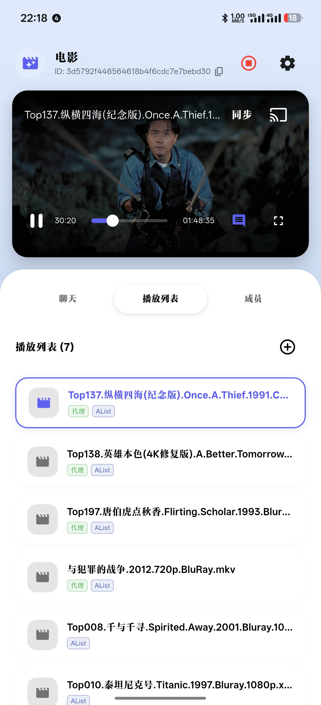

# SyncTV (一起看) 的一个前端项目，支持全平台。
<p align="center">
  <a href="https://github.com/TOM88812/SyncTV_APP/releases/latest">
    
  </a>
  <a href="https://opensource.org/licenses/Apache-2.0">
    
  </a>
  <a href="https://github.com/TOM88812/SyncTV_APP/stargazers">
    
  </a>
  <a href="https://github.com/TOM88812/SyncTV_APP/releases/latest">
    
  </a>

</p>

SyncTV 是一款跨平台的视频同步观看应用，允许用户创建或加入房间，与好友实时同步观看视频，并支持即时聊天、弹幕互动以及语音通话功能。

## Server 端项目介绍
**Server端作者**：[zijiren233](https://github.com/zijiren233)


**项目地址**：[SyncTV_SERVER](https://github.com/synctv-org/synctv)

## 📸 预览

| 首页 | 播放界面 |
|:---:|:---:|
|  |  |

## ✨ 主要功能

### 1. 房间系统
*   **创建/加入房间**：支持创建公开或加密房间。
*   **房间管理**：房主可管理房间设置（修改密码、踢出成员等）。
*   **多端同步**：无论是在 PC 还是移动端，都能获得一致的房间列表体验。

### 2. 视频同步播放
*   **多格式支持**：基于 `media_kit` 内核，支持 MP4, MKV, AVI, FLV, M3U8 等几乎所有主流音视频格式。
*   **精准同步**：毫秒级的播放进度同步，支持暂停、播放、倍速调节同步。
*   **画质调节**：支持多分辨率切换（需视频源支持）。

### 3. 社交互动
*   **实时聊天**：房间内内置 WebSocket 实时聊天室。
*   **弹幕系统**：支持视频弹幕显示，互动更有趣。
*   **语音通话**：基于 WebRTC 的实时语音交流功能，无需打字即可畅聊。

### 4. 资源管理
*   **电影/视频库**：支持添加和管理房间内的视频资源。
*   **目录浏览**：支持层级目录结构的视频资源浏览。
*   **链接解析**：支持直接添加网络视频链接（如 HLS/M3U8）。

### 5. 个性化体验
*   **深色模式**：自动适配系统深色/浅色模式，或强制纯白主题。
*   **自定义配置**：支持长按标题修改服务器地址，方便私有化部署连接。

## 🛠️ 技术栈

*   **框架**: Flutter (Dart)

## 🚀 快速开始

### 1. 环境要求
*   Flutter SDK >= 3.10.0
*   Dart SDK >= 3.0.0

### 2. 获取代码
```bash
git clone https://github.com/TOM88812/SyncTV_APP.git
cd synctv_app
```

## ⚙️ 隐藏功能
*   **修改服务器地址**：在首页长按顶部 "一起看" 标题，即可弹出服务器配置对话框，支持连接到私有部署的 SyncTV 后端。

## 📄 开源协议
Apache-2.0 license

# 免责声明

- 这个程序是一个免费且开源的项目。它旨在播放网络上的视频文件，方便多人共同观看视频和学习。
- 在使用时，请遵守相关法律法规，不要滥用。
- 该程序仅进行客户端播放视频文件/流量转发，不会拦截、存储或篡改任何用户数据。
- 在使用该程序之前，您应该了解并承担相应的风险，包括但不限于版权纠纷、法律限制等，这与该程序无关。
# 讨论

- [Telegram](https://t.me/synctv)
